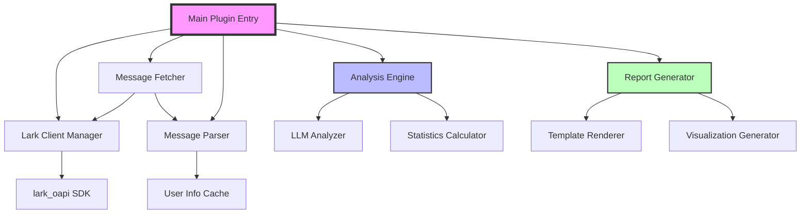

# Design Document

## Overview

This document describes the architectural design for refactoring the `astrbot-lark-group-daily-analysis` plugin. The refactored plugin will have a simplified, modular architecture that properly integrates with the Lark (Feishu) platform through the `lark_oapi` SDK.

### Design Goals

1. **Platform-Native Integration**: Use Lark SDK directly without unnecessary abstractions
2. **Clear Separation of Concerns**: Each module has a single, well-defined responsibility
3. **Maintainability**: Simple, readable code with clear data flow
4. **Extensibility**: Easy to add new analysis features or message types
5. **Robustness**: Graceful error handling and fallback mechanisms

## Architecture

### High-Level Architecture



### Module Structure

The refactored plugin will have the following flat module structure:

```
src/
├── lark/                    # Lark platform integration
│   ├── client.py           # Lark SDK client wrapper
│   ├── message_fetcher.py  # Message history retrieval
│   ├── message_parser.py   # Message format parsing
│   └── user_info.py        # User information fetching
├── analysis/               # Analysis logic
│   ├── topics.py          # Topic analysis
│   ├── users.py           # User activity analysis
│   ├── quotes.py          # Golden quotes extraction
│   └── statistics.py      # Statistical calculations
├── reports/               # Report generation
│   ├── generator.py       # Main report generator
│   ├── templates.py       # Report templates
│   └── visualizer.py      # Activity visualization
├── config.py              # Configuration management
└── models.py              # Data models
```

## Components and Interfaces

### 1. Lark Client Manager (`src/lark/client.py`)

**Purpose**: Provide a clean interface to the Lark SDK client.

**Key Methods**:
```python
class LarkClientManager:
    def __init__(self, context: Context):
        """Initialize with AstrBot context to get Lark adapter"""
        
    def get_client(self) -> lark.Client:
        """Get the Lark SDK client instance"""
        
    def get_bot_open_id(self) -> str:
        """Get the bot's open_id for filtering"""
```

**Design Decisions**:
- Single responsibility: Only manages SDK client access
- No caching or state management beyond client reference
- Raises clear exceptions if Lark adapter is not available

### 2. Message Fetcher (`src/lark/message_fetcher.py`)

**Purpose**: Retrieve message history from Lark API.

**Key Methods**:
```python
class MessageFetcher:
    def __init__(self, client_manager: LarkClientManager):
        """Initialize with client manager"""
        
    async def fetch_messages(
        self,
        chat_id: str,
        days: int,
        max_messages: int = 1000
    ) -> List[lark.Message]:
        """Fetch raw Lark messages from API"""
```

**Design Decisions**:
- Returns raw Lark SDK message objects for flexibility
- Handles pagination automatically
- Filters out bot's own messages
- Converts timestamps from milliseconds to seconds

### 3. Message Parser (`src/lark/message_parser.py`)

**Purpose**: Parse Lark message objects into a unified format.

**Key Methods**:
```python
class MessageParser:
    def __init__(self, user_info_cache: UserInfoCache):
        """Initialize with user info cache"""
        
    async def parse_message(self, msg: lark.Message) -> Optional[ParsedMessage]:
        """Parse a single Lark message"""
        
    def parse_text_content(self, content: str) -> str:
        """Parse text message content"""
        
    def parse_post_content(self, content: str) -> str:
        """Parse post (rich text) message content"""
        
    def parse_system_message(self, msg: lark.Message) -> Optional[str]:
        """Parse system message template"""
```

**ParsedMessage Model**:
```python
@dataclass
class ParsedMessage:
    message_id: str
    timestamp: int  # Unix timestamp in seconds
    sender_id: str  # open_id
    sender_name: str  # Actual nickname
    sender_avatar: str  # Avatar URL
    content: str  # Parsed text content
    message_type: str  # text, post, system, etc.
    raw_content: str  # Original content for debugging
```

**Design Decisions**:
- Async parsing to fetch user info when needed
- Handles all common Lark message types
- Returns None for unparseable messages (logged as warnings)
- Caches user information to minimize API calls

### 4. User Info Cache (`src/lark/user_info.py`)

**Purpose**: Fetch and cache user information from Lark API.

**Key Methods**:
```python
class UserInfoCache:
    def __init__(self, client_manager: LarkClientManager):
        """Initialize with client manager"""
        
    async def get_user_info(self, open_id: str) -> UserInfo:
        """Get user info, using cache if available"""
        
    async def batch_fetch_users(self, open_ids: List[str]) -> Dict[str, UserInfo]:
        """Batch fetch multiple users"""
        
    def clear_cache(self):
        """Clear the cache"""
```

**UserInfo Model**:
```python
@dataclass
class UserInfo:
    open_id: str
    name: str  # Display name
    avatar_url: str
    en_name: str  # English name (optional)
```

**Design Decisions**:
- In-memory cache with TTL (1 hour default)
- Batch fetching support for efficiency
- Fallback to "User_{open_id[:8]}" if fetch fails
- Uses `lark.contact.v3.User.get()` API

### 5. Analysis Engine

The analysis engine is split into focused modules:

#### Topics Analyzer (`src/analysis/topics.py`)

**Purpose**: Extract and summarize discussion topics using LLM.

**Key Methods**:
```python
class TopicsAnalyzer:
    def __init__(self, context: Context, config: ConfigManager):
        """Initialize with AstrBot context and config"""
        
    async def analyze(
        self,
        messages: List[ParsedMessage],
        umo: str
    ) -> Tuple[List[Topic], TokenUsage]:
        """Analyze topics from messages"""
```

**Improved LLM Prompt Strategy**:
- Format messages with actual usernames and timestamps
- Emphasize extracting specific, detailed discussions
- Request structured JSON output with validation
- Include examples of good vs. bad summaries

#### Users Analyzer (`src/analysis/users.py`)

**Purpose**: Analyze user activity patterns and assign titles.

**Key Methods**:
```python
class UsersAnalyzer:
    def __init__(self, context: Context, config: ConfigManager):
        """Initialize with AstrBot context and config"""
        
    async def analyze(
        self,
        messages: List[ParsedMessage],
        umo: str
    ) -> Tuple[List[UserTitle], TokenUsage]:
        """Analyze user activity and assign titles"""
```

**Analysis Metrics**:
- Message count and frequency
- Average message length
- Time distribution (day/night ratio)
- Reply patterns
- Emoji usage
- Topic participation

#### Quotes Analyzer (`src/analysis/quotes.py`)

**Purpose**: Extract memorable quotes from conversations.

**Key Methods**:
```python
class QuotesAnalyzer:
    def __init__(self, context: Context, config: ConfigManager):
        """Initialize with AstrBot context and config"""
        
    async def analyze(
        self,
        messages: List[ParsedMessage],
        umo: str
    ) -> Tuple[List[Quote], TokenUsage]:
        """Extract golden quotes"""
```

**Selection Criteria**:
- Impact and memorability
- Humor or insight
- Controversy or uniqueness
- Proper attribution with actual usernames

#### Statistics Calculator (`src/analysis/statistics.py`)

**Purpose**: Calculate basic statistical metrics.

**Key Methods**:
```python
class StatisticsCalculator:
    def calculate(self, messages: List[ParsedMessage]) -> Statistics:
        """Calculate statistics from messages"""
```

**Metrics**:
- Total message count
- Total character count
- Unique participant count
- Hourly distribution
- Peak activity periods
- Emoji statistics

### 6. Report Generator (`src/reports/generator.py`)

**Purpose**: Generate formatted reports from analysis results.

**Key Methods**:
```python
class ReportGenerator:
    def __init__(self, config: ConfigManager):
        """Initialize with config"""
        
    async def generate_text_report(self, analysis: AnalysisResult) -> str:
        """Generate text format report"""
        
    async def generate_image_report(
        self,
        analysis: AnalysisResult,
        html_render_func
    ) -> str:
        """Generate image format report"""
        
    async def generate_pdf_report(
        self,
        analysis: AnalysisResult
    ) -> str:
        """Generate PDF format report"""
```

**Design Decisions**:
- Uses Jinja2 templates for flexibility
- Includes user avatars in image/PDF reports
- Generates activity visualization charts
- Handles missing data gracefully

### 7. Configuration Manager (`src/config.py`)

**Purpose**: Centralized configuration management.

**Key Methods**:
```python
class ConfigManager:
    def __init__(self, astrbot_config: AstrBotConfig):
        """Initialize with AstrBot config"""
        
    def get_analysis_days(self) -> int:
        """Get number of days to analyze"""
        
    def get_max_messages(self) -> int:
        """Get maximum messages to fetch"""
        
    def get_enabled_groups(self) -> List[str]:
        """Get list of enabled group IDs"""
        
    # ... other config getters
```

## Data Models

### Core Models (`src/models.py`)

```python
@dataclass
class ParsedMessage:
    """Unified message format"""
    message_id: str
    timestamp: int
    sender_id: str
    sender_name: str
    sender_avatar: str
    content: str
    message_type: str
    raw_content: str

@dataclass
class Topic:
    """Discussion topic"""
    title: str
    participants: List[str]  # Actual names
    description: str
    message_count: int

@dataclass
class UserTitle:
    """User activity title"""
    open_id: str
    name: str
    avatar_url: str
    title: str
    mbti: str
    reason: str
    metrics: UserMetrics

@dataclass
class UserMetrics:
    """User activity metrics"""
    message_count: int
    char_count: int
    avg_message_length: float
    emoji_count: int
    reply_count: int
    hourly_distribution: Dict[int, int]

@dataclass
class Quote:
    """Golden quote"""
    content: str
    sender_name: str
    sender_avatar: str
    timestamp: int
    reason: str

@dataclass
class Statistics:
    """Group statistics"""
    message_count: int
    char_count: int
    participant_count: int
    hourly_distribution: Dict[int, int]
    peak_hours: List[int]
    emoji_stats: EmojiStats

@dataclass
class AnalysisResult:
    """Complete analysis result"""
    topics: List[Topic]
    user_titles: List[UserTitle]
    quotes: List[Quote]
    statistics: Statistics
    token_usage: TokenUsage
    analysis_period: Tuple[datetime, datetime]
```

## Error Handling

### Error Handling Strategy

1. **API Errors**: Log detailed error information and return empty results
2. **Parsing Errors**: Skip individual messages, log warnings
3. **LLM Errors**: Retry with exponential backoff, fallback to basic analysis
4. **JSON Parsing Errors**: Use regex extraction as fallback
5. **Configuration Errors**: Fail fast with clear error messages

### Logging Levels

- **DEBUG**: Raw API responses, parsed message details
- **INFO**: Analysis progress, statistics
- **WARNING**: Skipped messages, fallback usage
- **ERROR**: API failures, critical errors

## Testing Strategy

### Unit Tests

- Message parser with various Lark message formats
- User info cache hit/miss scenarios
- Statistics calculator with edge cases
- Configuration validation

### Integration Tests

- End-to-end message fetching and parsing
- LLM analysis with mock responses
- Report generation with sample data

### Manual Testing

- Test with real Lark groups
- Verify user names and avatars
- Check report accuracy
- Test error scenarios (API failures, etc.)

## Performance Considerations

### Optimization Strategies

1. **User Info Caching**: Reduce API calls by caching user information
2. **Batch Fetching**: Fetch multiple users in a single API call when possible
3. **Message Limiting**: Cap maximum messages to prevent memory issues
4. **Async Operations**: Use asyncio for concurrent API calls
5. **Lazy Loading**: Only fetch user info when needed for reports

### Resource Limits

- Maximum messages per analysis: 1000 (configurable)
- User info cache size: 500 users
- User info cache TTL: 1 hour
- LLM timeout: 30 seconds (configurable)
- Maximum retries: 3 (configurable)

## Migration Path

### Phase 1: Core Infrastructure
1. Implement new Lark client manager
2. Implement message fetcher
3. Implement message parser
4. Implement user info cache

### Phase 2: Analysis Refactoring
1. Refactor topics analyzer with improved prompts
2. Refactor users analyzer with actual user info
3. Refactor quotes analyzer with proper attribution
4. Update statistics calculator

### Phase 3: Report Generation
1. Update report templates with user avatars
2. Enhance visualization with accurate data
3. Test all output formats (text/image/PDF)

### Phase 4: Cleanup
1. Remove old bot_manager module
2. Remove unnecessary abstractions
3. Update documentation
4. Add comprehensive tests

## Security Considerations

1. **API Credentials**: Never log API tokens or sensitive credentials
2. **User Privacy**: Cache user info temporarily, clear on plugin restart
3. **Input Validation**: Validate all configuration inputs
4. **Error Messages**: Don't expose internal details in user-facing errors
5. **Rate Limiting**: Respect Lark API rate limits

## Future Enhancements

1. **Multi-language Support**: Detect and handle different languages
2. **Advanced Analytics**: Sentiment analysis, topic trends over time
3. **Custom Titles**: Allow admins to define custom title criteria
4. **Export Options**: Export raw data for external analysis
5. **Real-time Analysis**: Analyze messages as they arrive
